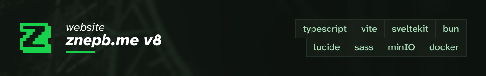

This is the eighth (and hopefully final) iteration of znepb.me, featuring a newly refreshed design by [AutiOne](https://auti.one), management via YML files, and improved accessability.

# [Go check it out!](https://znepb.me)

## Stack

- TypeScript, for general scripting
- Vite for the build system
- SvelteKit for web rendering
- Bun for TypeScript runtime
- Lucide for icons
- SASS for styling
- MinIO for file storage
- Docker for hosting

## License

This project is licensed under the GNU Affero General Public License v3 (AGPLv3). That means you are welcome to do with the code as you see fit, but if you make any changes, you must share the source of your changes. While the license doesn't necessarily prohibit the following behavior, I ask that you do not steal my website and its design without making any meaningful change to it.

This license does not apply to the files in `/src/lib/assets/images`. Those are all property of their respective copyright owners, visible on [znepb.me/attributions](https://znepb.me/attributions).

## Generative AI notice

Absolutely no AI was used to write code for this project. No GitHub Copilot, Claude, or other tool was used to write any code in this project. While I recognize the significance of these tools, I did not use them in this project, because I find that it removes much of the joy from programming. AI was seldomly used to research Svelte and SASS issues (specifically Google AI summaries), but no code was directly copied from results. The design was made entirely by hand by AutiOne in Figma. Furthermore, no images on this site were generated by AI. They were either taken by humans, or taken directly in games, where applicable.
